<div align="center">

<a href="README.md">🇷🇺 Русский</a> · <a href="README.en.md">🇬🇧 English</a> · <a href="README.uk.md">🇺🇦 Українська</a> · <a href="README.ro.md">🇷🇴 Română</a>

<br /><br />


# 👶 BabyTracker

### *Вайб-кодинг зустрічає батьківство*

[](https://react.dev)
[](https://www.typescriptlang.org)
[](https://vitejs.dev)
[](https://tailwindcss.com)
[](https://www.framer.com/motion)

> *"Зробив о 3 ночі поки дитина спала. Вона не спить. Я не сплю. Але дашборд виглядає вогонь."*

[](https://your-demo-url.vercel.app)
[](https://github.com/you/babytracker/releases)

</div>

---

## 📸 Скріншоти

<div align="center">

### Поточна версія

| Головна | Додати | Статистика | Налаштування |
|:---:|:---:|:---:|:---:|
| 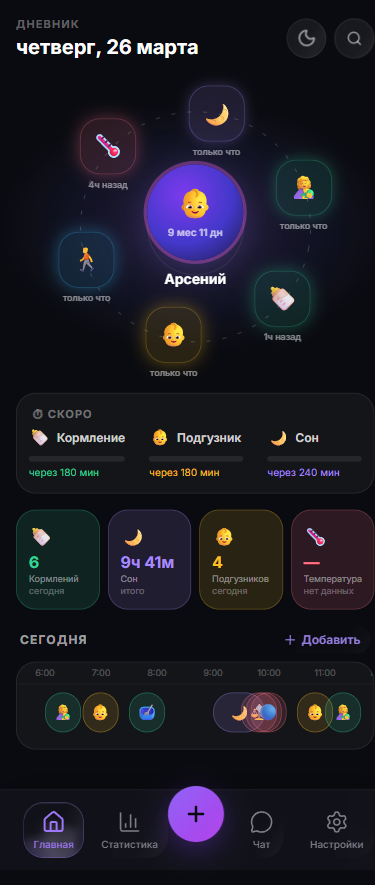 | 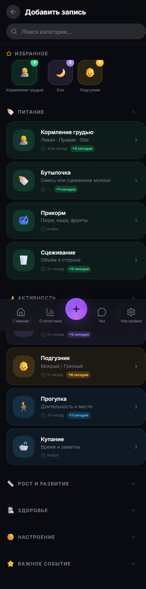 | 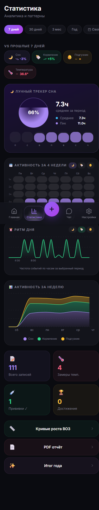 | 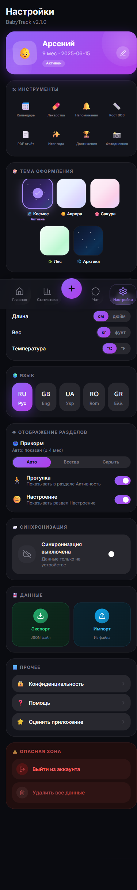 |

| Чат | Досягнення | Авторизація | Зведення дня |
|:---:|:---:|:---:|:---:|
| 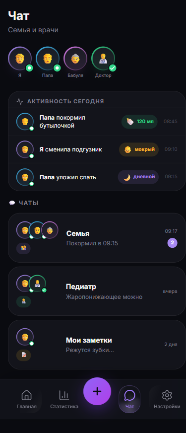 | 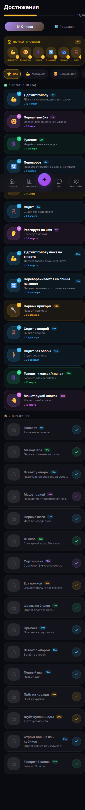 | 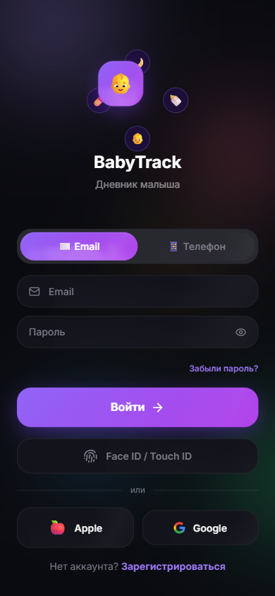 | 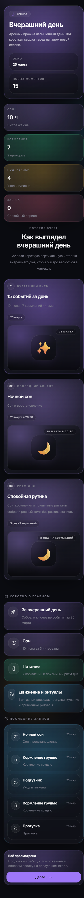 |

### Оригінальний застосунок (App Store) — звідки все почалося

| | | | |
|:---:|:---:|:---:|:---:|
|  | 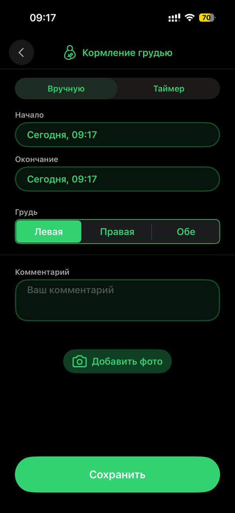 | 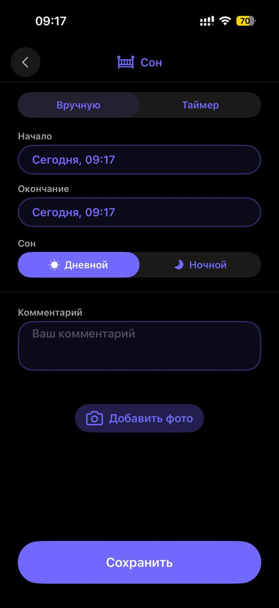 |  |
|  | 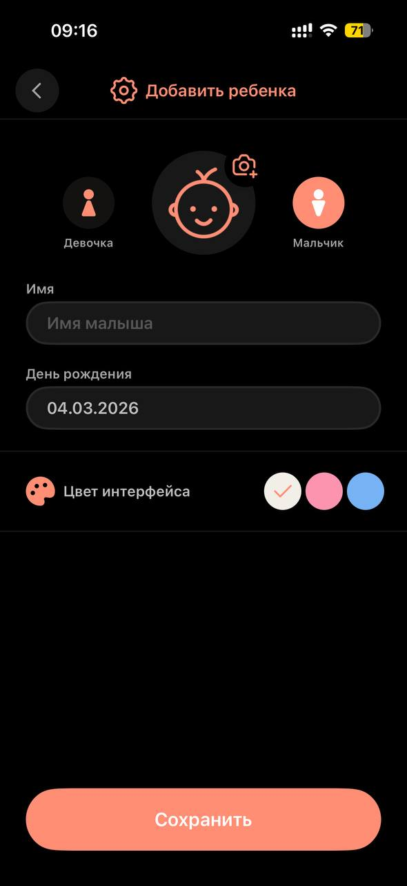 |  | 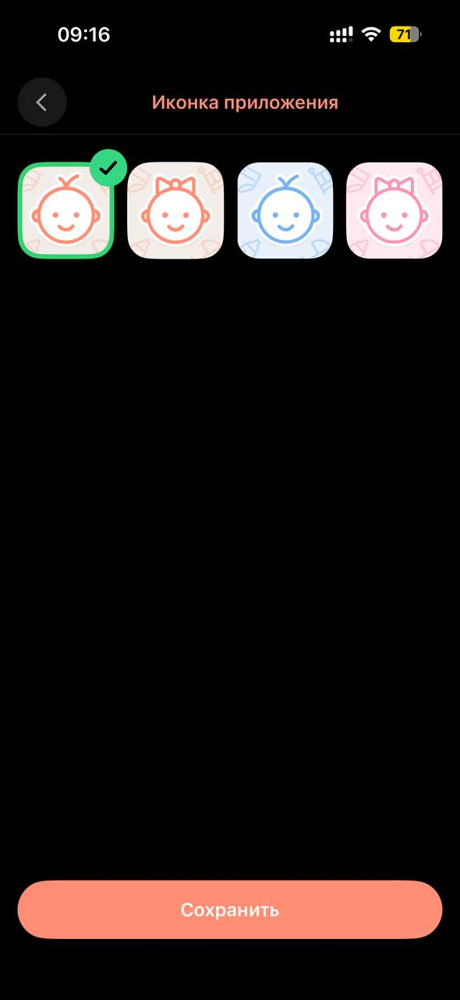 |

</div>

---

## 🧬 Історія створення

Все почалося з одного застосунку з **App Store** — простого, але неймовірно корисного трекера для малюків. Він реально допомагав у перші два роки: кожне годування, кожен сон, кожен підгузок — все під рукою в будь-який час ночі.

Але у нього були свої обмеження. І одного дня прийшла думка: *а що якщо взяти цю ідею та зробити її краще? Додати те чого не вистачало, прибрати те що дратувало, і побудувати щось своє.*

Так **25 січня 2025 року** з'явився цей проект. І це не фінальна точка — це лише початок. Застосунок буде постійно розвиватися, вдосконалюватися і доповнюватися новими фічами. Тому що гарні ідеї не закінчуються.

---

Цей проект — чесна відповідь на питання **"що таке вайб-кодинг насправді?"**

```
1. 💡 Ідея           →  Lovable.dev       (накидав UI за вечір, магія)
2. 🔧 Доробка        →  Claude + ChatGPT  (пояснював, лагодив, переписував)
3. 🚀 Фінальний вид  →  Руки + голова     (куди ж без цього)
```

**Спойлер:** вайб-кодинг працює. Але не так як показують у TikTok.

> *Без мінімального розуміння що відбувається в коді — ти не вайб-кодиш,*
> *ти просто тискаєш кнопки і молишся. Це називається інакше.*

Різниця між "вайб-кодером" і "просто тим хто сподівається":
- Ти розумієш **що** просиш зробити, навіть якщо не знаєш **як**
- Ти читаєш що AI написав і розумієш хоча б логіку
- Ти можеш пояснити баг словами, а не просто "воно не працює"

**Lovable** дав красивий старт за кілька годин замість кількох днів.
**Claude** допоміг розібратися з архітектурою, полагодити баги і не зламати те що працює.
**ChatGPT** допоміг сформулювати ідеї коли думки в голові ще не стали словами.

Підсумок: проект який реально працює, а не просто скріншот для соцмереж. 🎯

---

## ✨ Що це таке

Застосунок для відстеження всього що відбувається з твоїм малюком — від першого годування до першого слова. Написаний з любов'ю, кофеїном і трошки Claude AI о 3 годині ночі.

Ніякого бекенду. Ніякої хмари. Тільки ти, браузер, і **localStorage** як надійний друг.

---

## 🚀 Стек (за який не соромно)

| Технологія | Версія | Навіщо |
|---|---|---|
| ⚛️ React | 19 | Тому що 18 — це вже минулий рік |
| ⚡ Vite | 8 | Гаряче перезавантаження швидше ніж плач дитини |
| 🎨 Tailwind CSS | 4 | CSS написаний в HTML — звучить дико, виглядає красиво |
| 💃 Framer Motion | 12 | Анімації яких ніхто не просив, але всі оцінили |
| 🧩 Radix UI | latest | Доступність з коробки, жодних компромісів |
| 📊 Recharts | 2 | Графіки які батьки дивляться о 2 ночі |
| 🗺️ React Router | 7 | 30+ сторінок і жодного перезавантаження |
| 🔷 TypeScript | 5 | Тому що `any` — це не для нас |

---

## 🌟 Функції

### 🍼 Годування
- Пляшечка з об'ємом в мл
- Грудне вигодовування з таймером і вибором сторони
- Зціджування з відстеженням об'єму
- Історія всіх годувань

### 🌙 Сон
- Таймер сну в реальному часі
- Якість сну (міцний / легкий / неспокійний)
- Статистика по днях і тижнях

### 💧 Підгузки
- Мокрий / брудний / змішаний / сухий
- Кількість за день/тиждень на графіку
- Швидке додавання одним дотиком

### 📏 Ріст і вага
- Криві росту з перцентилями
- Графік ваги з Recharts
- Відстеження кола голови

### 🏆 Досягнення
- Перша усмішка, перший зуб, перші кроки
- Фотоальбом для кожного досягнення
- Поширення одним кліком

### 💊 Здоров'я
- Журнал температури
- Прийом ліків з дозуваннями
- Візити до лікаря
- Графік вакцинації

### 📅 Нагадування
- Push-сповіщення
- Повторювані події
- Кастомні нагадування

### 🤖 AI Чат
- Вбудований асистент для питань
- Поради щодо розвитку малюка
- Відповіді на тривожні питання о 3 ночі

### 📄 PDF Звіти
- Експорт даних для педіатра
- Повна історія подій
- Графіки в PDF

### 📸 Фотощоденник
- Галерея прив'язана до віку
- Порівняння "тоді і зараз"

---

## 🎨 5 Тем оформлення

```
🌸 Pink Dream    — ніжно-рожева, для принцес і їхніх тат
🌊 Ocean Blue    — спокійний синій, для морських вовків
💜 Purple Haze   — фіолетовий, для нічних сесій кодингу
🌿 Nature Green  — зелений, для еко-батьків
🌙 Dark Mode     — для тих хто годує в темряві не вмикаючи світло
```

---

## 🏗️ Архітектура (localStorage edition)

```
браузер
  └── localStorage
        ├── babytrack_users        // акаунти (bcrypt-like через btoa)
        ├── babytrack_token        // сесія
        ├── babytrack_events       // всі події
        ├── babytrack_profile      // профіль малюка
        ├── babytrack_milestones   // досягнення
        ├── babytrack_photos       // фото (base64)
        └── babytrack_reminders    // нагадування
```

> *Так, все в localStorage. Ні, це не проблема. Бекенд буде колись потім.*

---

## 🚦 Швидкий старт

```bash
# Клонуй репо
git clone https://github.com/you/babytracker.git
cd babytracker

# Встанови залежності
npm install

# Запусти
npm run dev

# Відкрий і насолоджуйся
# http://localhost:5173
```

---

## 🔐 Авторизація

Повністю локальна авторизація:
- Реєстрація з хешуванням пароля (btoa-based)
- Сесійний токен в localStorage
- Відновлення пароля без email (локальний reset)
- Автоматичний вхід при наявності токена

---

## 📱 Responsive Design

| 📱 Мобілка | 💻 Десктоп |
|---|---|
| Tab Bar знизу | Sidebar зліва |
| Swipe-friendly | Hover-states |
| Touch-оптимізовано | Keyboard-accessible |

---

## 🎓 Чесно про вайб-кодинг

Найбільший урок цього проекту був не в тому, що AI "пише код за тебе", а в тому, що він дуже швидко генерує напрямок — але майже ніколи не доводить продуктову інтеграцію до кінця без ручної інженерної роботи.

### З чим реально стикалися

- AI регулярно приносив красиві компоненти, але під інший стек
- Багато блоків виглядали нормально на скріншоті, але розвалювалися на tablet/mobile
- Часто з'являлося дублювання логіки — новий красивий компонент зверху, старий робочий знизу
- Ефекти типу liquid/glow спочатку виглядали ефектно, але заважали UX
- Кожну нову сесію потрібно було заново пояснювати контекст архітектури

### Що реально допомогло

- Використовувати AI як швидкий чернетку і генератор напрямків, а не як фінального автора
- Відразу перевіряти як компонент живе всередині існуючого UX
- Швидко різати зайве: якщо новий блок створює дублювання — видаляй старе або не впроваджуй нове
- Після кожної помітної зміни запускати збірку і дивитися реальні розміри

> *Якщо коротко: вайб-кодинг стискає тижні в дні — але не так як показують у TikTok.
> Там показують перші 20%. Решта 80% — це звичайна інженерна робота, просто з кращим чернетком в руках.*

---

## 🧪 TODO (колись)

- [ ] Бекенд (Supabase / Firebase / що завгодно)
- [ ] Синхронізація між пристроями
- [ ] Push-сповіщення через Service Worker
- [ ] Експорт/імпорт даних
- [ ] Поширення з партнером
- [ ] Сон (це вже для малюка, не для розробника)

---

## 🤝 Внесок у проект

Знайшов баг о 3 ночі поки годуєш дитину? Створюй issue. Хочеш додати фічу? PR welcome.

Головне правило: **коміти повинні бути написані не гірше ніж код**.

---

<div align="center">

Зроблено з ☕ кавою, 😴 недосипом і 💜 любов'ю

*"Вайб-кодинг — це коли ти не знаєш як це працює, але воно працює"*

**⭐ Star this repo** якщо твій малюк хоч раз поспав більше 3 годин поспіль

</div>
